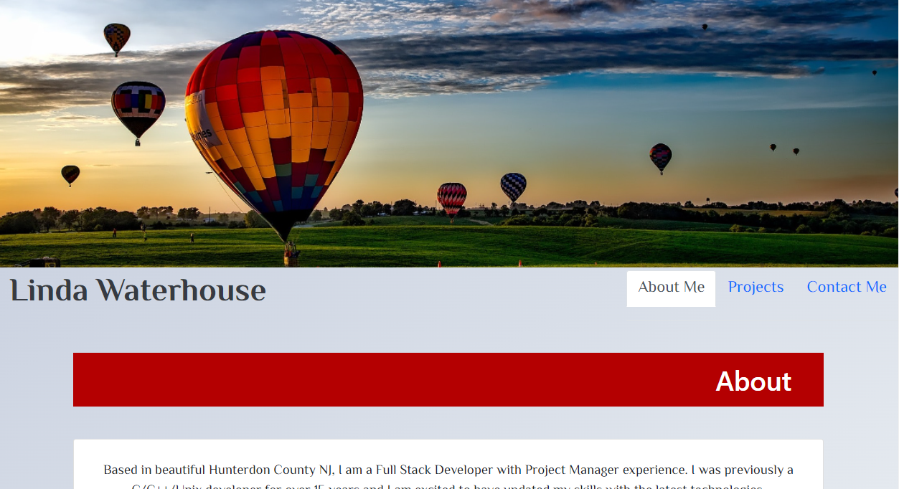

# Linda Waterhouse Portfolio (React)
My updated portfolio build with React.

## Table of Contents
* [Description](#description)
* [Installation](#installation)
* [Usage](#usage)
* [Built With](#built-with)
* [Screenshot](#screenshot)
* [Author](#author)
* [Questions](#questions)
* [Repository](#repository)
* [License](#license)

## Description

My current portfolio written with React.  As a bonus, I integrated EmailJS so that my Contact form can send me an email with the information that the user entered in the Contact form.

## Installation

### Download the code from the repository and create your React environment
> npx create-react-app my-app
> npm i

## Usage

Run (from your repository)
>npm start

or click on https://llwaterhouse.github.io/React-Portfolio

## Built With

* Mongoose
* MongoDB
* Express
* node.js
* React
* EmailJS.com

## Screenshot

## Author

[Linda Waterhouse](https://github.com/llwaterhouse)

## Questions

If you have any questions or would like to contribute, please contact me via my Github link above.

## Repository
Click here to see the github repository https://github.com/llwaterhouse/React-Portfolio

## License

MIT License 

Copyright (c) [2021] [MVC-Tech-Blog]

Permission is hereby granted, free of charge, to any person obtaining a copy
of this software and associated documentation files (the "Software"), to deal
in the Software without restriction, including without limitation the rights
to use, copy, modify, merge, publish, distribute, sublicense, and/or sell
copies of the Software, and to permit persons to whom the Software is
furnished to do so, subject to the following conditions:

The above copyright notice and this permission notice shall be included in all
copies or substantial portions of the Software.

THE SOFTWARE IS PROVIDED "AS IS", WITHOUT WARRANTY OF ANY KIND, EXPRESS OR
IMPLIED, INCLUDING BUT NOT LIMITED TO THE WARRANTIES OF MERCHANTABILITY,
FITNESS FOR A PARTICULAR PURPOSE AND NONINFRINGEMENT. IN NO EVENT SHALL THE
AUTHORS OR COPYRIGHT HOLDERS BE LIABLE FOR ANY CLAIM, DAMAGES OR OTHER
LIABILITY, WHETHER IN AN ACTION OF CONTRACT, TORT OR OTHERWISE, ARISING FROM,
OUT OF OR IN CONNECTION WITH THE SOFTWARE OR THE USE OR OTHER DEALINGS IN THE
SOFTWARE.

